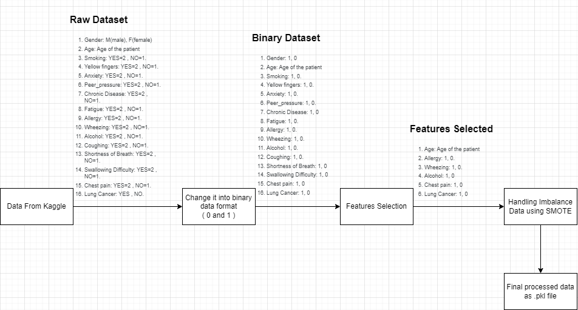

# Project introduction

Predicting a data from person, that will spit out classification is it lung cancer or not.

## Data Preprocessing and Feature Engineering



## Modelling


## API flow - Predict


## API Body Request & Response

- **BASE URL**: http://34.101.79.86:8000

- **ENDPOINT**: `/v1/predict`

- **Method:**: `POST`

BODY Request

```
{
  "age": 62,
  "alcohol_consuming": false,
  "wheezing": false,
  "allergy": true,
  "chest_pain": true
}
```

Response

```
Status Code: 200
{
	"message": "Successfully predict the lung cancer person",
	"is_lung_cancer": true
}
```

## Project installaation

```
git clone https://github.com/beebeewijaya-tech/lung-cancer-prediction.git

python -m venv venv

venv\Scripts\activate.bat
```

## How to run the project

```
run-dev:
	uvicorn main:app --reload  --host 0.0.0.0

install-dev:
	pip install -r requirements.txt

build:
	docker build . -t beebeewijaya/lung-cancer-analysis:latest

run:
	docker run -p 8000:8000 beebeewijaya/lung-cancer-analysis:latest

push:
	docker push beebeewijaya/lung-cancer-analysis:latest

test:
	pytest
```

To run locally you can just run `make install-dev` & `make-run-dev`

## How to re-train the model

Go to `notebooks/04_modelling.ipynb` change some of the parameters and run all of the process from the notebook.

Afterwards see the result at `models/`
